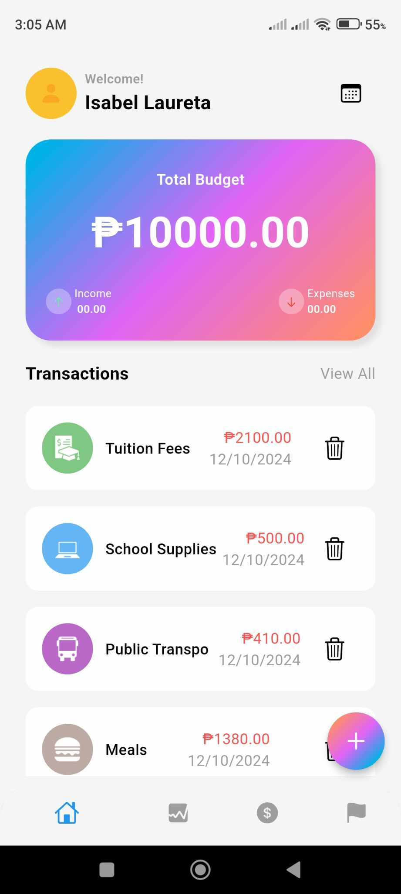

Campus Cash
Campus Cash is an ongoing project that aims to develop a cross-platform budgeting application specifically tailored for college students. Available on both iOS and Android, the app empowers students to effectively manage their finances with a comprehensive set of features designed to promote financial literacy and well-being.

Features
Income & Expense Tracking: Easily add and categorize income sources and expenses for streamlined financial management.
Multiple Budgeting Techniques: Choose from various budgeting methods to find what best suits your financial goals.
Budget Setup: Set up and adjust budgets based on different timeframes and financial targets.
Data Visualization: Access insightful data visualizations to better understand spending patterns and financial health.
Transaction History: Maintain a detailed transaction history to track all past expenses and income.
Goal Module: Define financial goals, such as savings targets or debt repayment, and track your progress toward achieving them.

Built With
Flutter & Dart: For building the mobile application with a single codebase across iOS and Android platforms.
Firebase: Utilized for backend services, including data storage, authentication, and real-time data syncing.
Laravel & PHP: For developing the web-based admin module, providing robust backend support and routing.
JavaScript: Enhances the interactivity of the web-based admin module.
Campus Cash is designed with a web-based admin module for enhanced data management and analytics. Stay tuned as we continue to add new features and enhancements to make budgeting accessible and effective for all college students.
